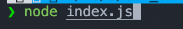
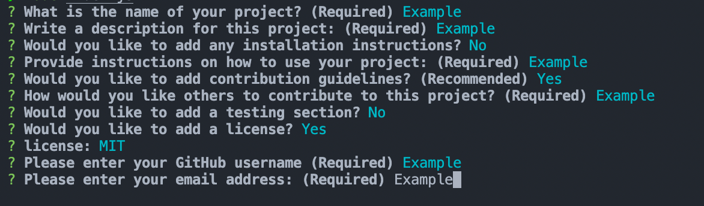
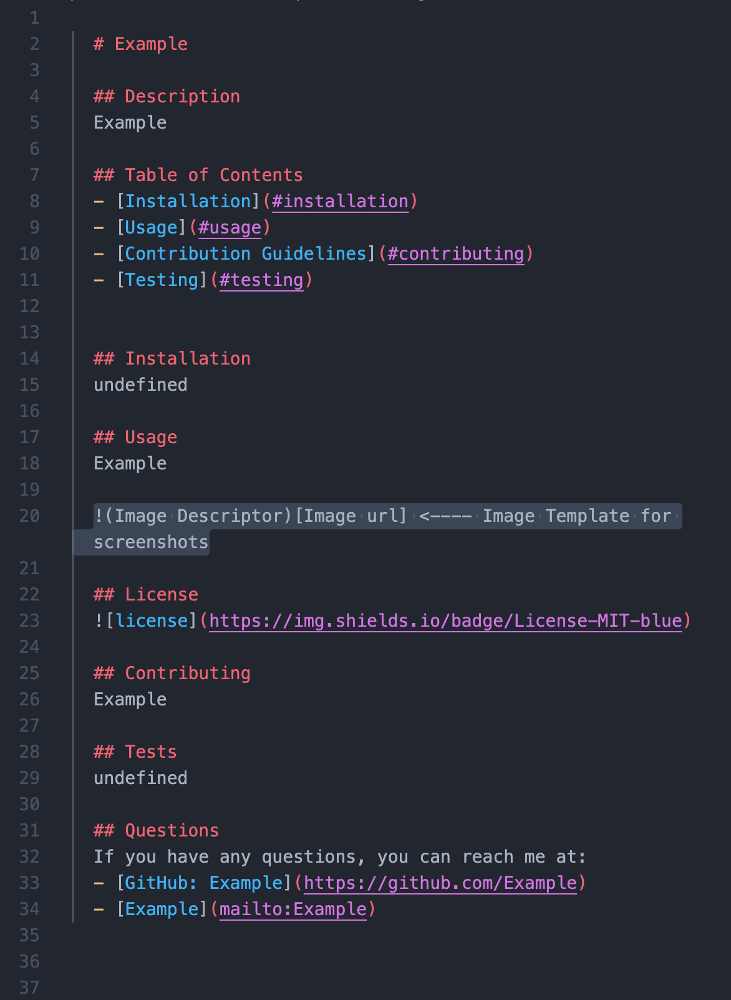

# README Generator

## Description

A easy to use NodeJS application that allows you to create professional README documents for any of your GitHub projects!

## Table of Contents

- [Installation](#installation)
- [Usage](#usage)

## Installation

1. Download zip file of this project
2. Ensure that NodeJS and Inquirer are installed on your device

## Usage

1. (After completing the installation process) Run `node index.js`

   

2. Answer Prompts

   

3. Edit and enjoy you new polished README file

   

## License

## Questions

If you have any questions, you can reach me at:

- [GitHub: J0J0C0DING](https://github.com/J0J0C0DING)
- [joeyrebne.bootcamp@gmail.com](mailto:joeyrebne.bootcamp@gmail.com)
